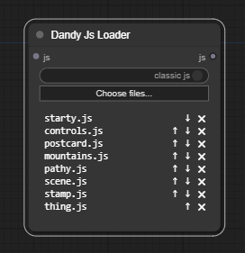
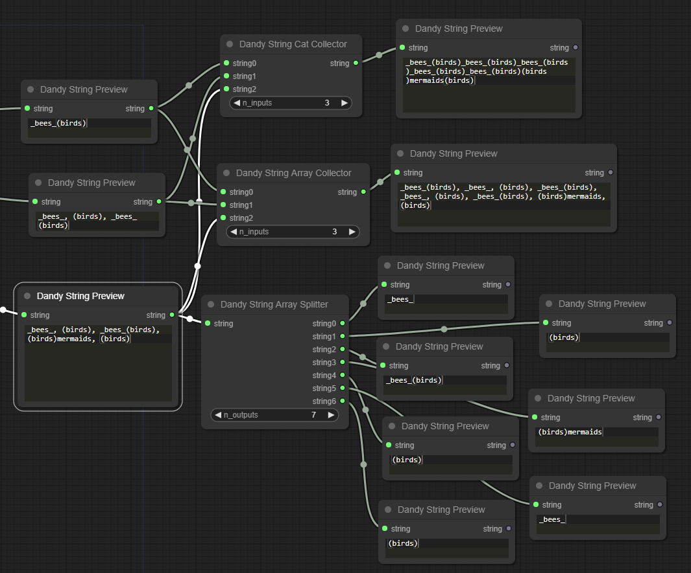
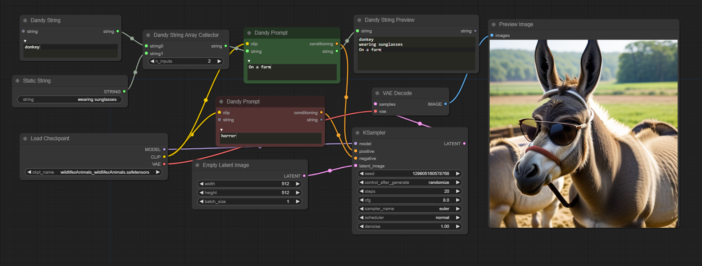
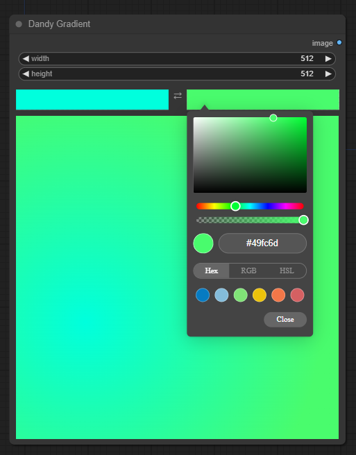
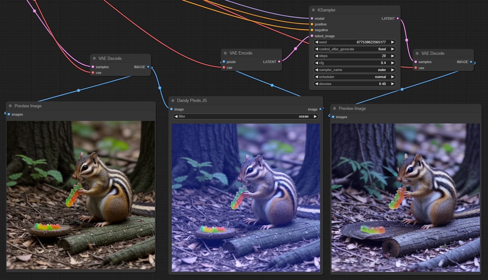
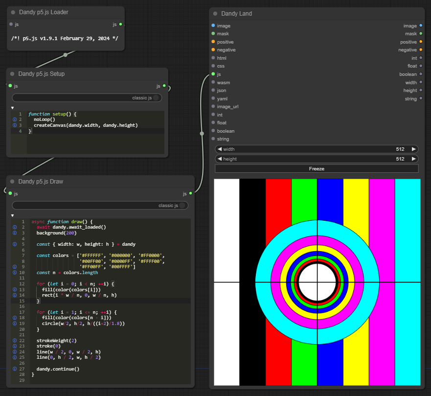

Dandy
-----

Dandy is a JavaScript bridge for ComfyUI. It includes everything you need to make JavaScript enabled extensions, or just load and code in little editor nodes right in ComfyUI.

Dandy Land
----------
Your JavaScript will run in Dandy Land, separate from the JavaScript that composes ComfyUI (Comfy Land). There are nodes for all the web programming basics: HTML, CSS, JS, WASM, JSON, YAML. There are inputs and outputs for Comfy types: Images, Masks, ints, floats, booleans, strings, even conditioning. Most of these also support arrays/batches. Everything is available in JS from a global `dandy` object. If you sent in a batch of 4 images, `dandy.image[]` will be an array of loaded img DOM elements. Do some image processing and draw it to an html canvas and it will be sent to comfy, and sent along your workflow as a comfy tensor, aka an IMAGE.

Or maybe you're doing some prompt building, you can output your string by writing it to `dandy.output.string`, connect the string output to a `Dandy Prompt` node, and connect that to your `positive`/`negative` inputs.  

Dandy Chains
------------
Dandy works a little differently from standard ComfyUI. In comfy the data flows when you queue the prompt. Dandy nodes send their data immediately. This way you can edit your code and see the results immediately. You can chain together Dandy nodes, and the results will be collected from left to right. For instance you have a loader loading some code, connect the js to the input of an editor, put in some code, connect the output js to Dandy Land, and all the code will be loaded.

`dandy.onload(), dandy.await_loaded(), and dandy.continue()`
------------------------------------------------------------

When the page is ready and all the inputs and scripts are loaded, `dandy.onload()` will run. Set it like:

    dandy.onload = () => {
        // Your code 
     }

If instead you just want to wait in place until everything is loaded before continuing, you can `await dandy.await_loaded()`, that will need to go in an async function of course. You can do both, `onload()` will finish before `await_loaded()` returns.

    const my_render_code = async () => {
      // wait until input images are loaded
      await dandy.await_loaded()
      
      // render stuff to a canvas
      
      // continue the comfy graph
      dandy.continue()
    }

If you aren't using input images you don't need to wait for anything, numbers and strings will be there. Like if you just need `dandy.width` and `dandy.height` you don't need to wait.

When you are done rendering, call `dandy.continue()`. If you don't then when you queue the prompt comfy will wait forever at your node. If you don't want to, you can hit the freeze button, it will continue.

Images and Masks
---------

In a `DandyLand` or your custom `DandyTown` node, images are collected and loaded as DOM elements, avalible in `dandy.image[]` and `dandy.mask[]`. To output an image or mask, render something to an html `canvas`. It will be collected and sent out the `image` and `mask` outputs. The mask will be converted to greyscale. If you have multiple canvases, you will output a batch, and if they aren't the same size the batching will resize them.

Masks are just greyscale images. Originally I did it with alpha levels but it turns out doing alphas in a canvas is a massive PITA. If enough people bug me maybe we can have a mode where it works with alphas.

Dandy Editors
-------------

You have editor nodes for JS, HTML, CSS, JSON, YAML, strings, and a prompt.

You can change alot of settings with the Dandy Editor Settings node, fonts, theme, keybindings, etc..

F11 makes them fullscreen.

There are preview nodes, these are read-only editors to examine strings, ints, floats, booleans.

If you load and save files, you are uploading and downloading files, it doesn't sync with any files on the filesystem.

You can change editor settings with the `Dandy Editor Settings` node.

Dandy Loaders
-------------

You can load files with the loaders. Again it's uploading these files, and won't detect changes from the filesystem.

You can also load from a URL with `Dandy URL Loader`. Expect CORS issues, you might not always be able to solve your problem with a URL loader.

Dandy Collectors and Splitters
------------------------------
Dandy treats ints, floats, strings, and booleans as either values or arrays. If you want to output an array of ints you can hang a `Dandy Int Splitter` off the `int` output, and split it into individual outputs. If you want to collect various ints and send them to `Dandy Land`, you can use a `Dandy Int Collector`.

Strings have two collectors, `Dandy String Array Collector` and `Dandy String Cat Collector`. The first builds an array, the cat collector outputs one string of all the inputs concatenated. 

By default string inputs are concatenated. In the above screenshot we're collecting an array of strings but then the `Dandy Prompt` concatenates them. Nodes that do not do this are: `Dandy String Preview`, `Dandy String Array Collector`, and `Dandy Land`/`Dandy Town`.

The Image and Mask collectors batch them as comfy images, this will resize them all to same size. If you want them unaffected, you can use the image_url output instead. These will also end up in `dandy.image[]` and `dandy.mask[]` as loaded `img` DOM elements.

Dandy Town
----------

You can make your own Dandy Nodes, see the examples (PixiJS, PixelsJS, Gradient). In these we extend DandyTown, and provide all the inputs and code internally. The end effect is you have a single node that runs your code, without having to hang a bunch of editors and loaders off the node.

Dandy Gradient
--------------

Simple gradient with colour pickers, outputs an image.

Dandy PixelsJS
--------------

Simple example of the PixelsJS image filters. The simplest example of a Dandy Town.

Dandy PixiJS
------------

An example using PixiJS Filters, lots of filters in here, tons of values to twiddle.

Dandy p5.js
---

Load p5.js with `Dandy P5.js Loader`, use `Dandy P5.js Setup`, and `Dandy P5.js Draw` nodes, connect them to `Dandy Land`. Code some p5.

When you create them some skeleton code is inserted to you can get coding right away.
